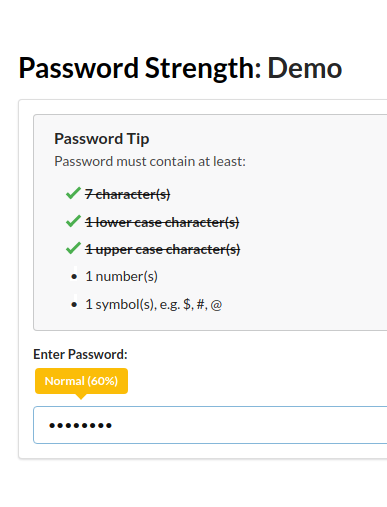

# Password Strength Meter

This is a jQuery plugin that will check the value of a password field and evaluate the strength of the typed password. This is done by checking for the diversity of character types: numbers, lowercase and uppercase letters and special characters (symbols).

## Requirements

 - [jQuery](https://jquery.com/) 1.6 or greater

## Installation

To install the **Password Strength Meter** in a web page, include the _jquery.password_strength.js_ file as one of the last elements within the `body` element of the html like so,

```
<script type="text/javascript" src="jquery.password_strength.js"></script>
```

The style sheet used by this plugin is the Semantic-UI 2.4.0. Reference can be made in the head tag of the web page to [the stylesheet](semantic.min.css) within this repo as follows,

```
<link href="semantic.min.css" rel="stylesheet" />
```
[](demo.html)

More ideas can be gathered from the [demo](demo.html).

## Usage

To use, call the function on a password field like so,

```js
$('input[type=password]').password_strength(options);
```

The options argument is optional. Available values to set are:

* __minCharacters__: Minimum characters allowed in total.

* __minLowerCaseCharacters__: Minimum lowercase alphabetic characters allowed.

* __minUpperCaseCharacters__: Minimum uppercase alphabetic characters allowed.

* __minNumbers__: Minimum numeric characters allowed.

* __minSymbols__: Minimum non-alphanumeric characters allowed.

* __onCheck__: A callback that gets called after a strength check. Gets the new strength value as a parameter.

The example below is a snippet from the [demo](demo.html), where the password meter takes a minimum of 8 characters, 1 lowercase, 1 uppercase, 1 number and 1 symbol for a strong password.

```js
var passwordLevel = 0;
$('#password').password_strength({
    minCharacters: 8,
    minLowerCaseCharacters: 1,
    minUpperCaseCharacters: 1,
    minNumbers: 1,
    minSymbols: 1,
    onCheck: function (l, c, s) {
        passwordLevel = l;
        for (var prop in c) {
            if (c[prop] >= s[prop]) {
                $('#li-' + prop + '-length').addClass('checked');
            } else {
                    $('#li-' + prop + '-length').removeClass('checked');
            }
        }
	}
});
```

The `onCheck` event handler is used in the demo to apply a styling to a bullet-list of required characters for the password meter. The way how this works is that the second parameter of `onCheck` sends back an object that contains the current count of characters, lowercase characters, uppercase characters, numbers and symbols, while the third parameter sends back an object of same signature with the required count as set in options. An example of the data structure returned for both the second and third parameter of `onCheck` are seen below,

```js
{
    characters: 8,
    lowers: 1,
    uppers: 1,
    numbers: 1,
    symbols: 1
}
```

## Contributions

Developers are welcomed to fork a copy of this repo, make changes and submit pull requests as they desire.